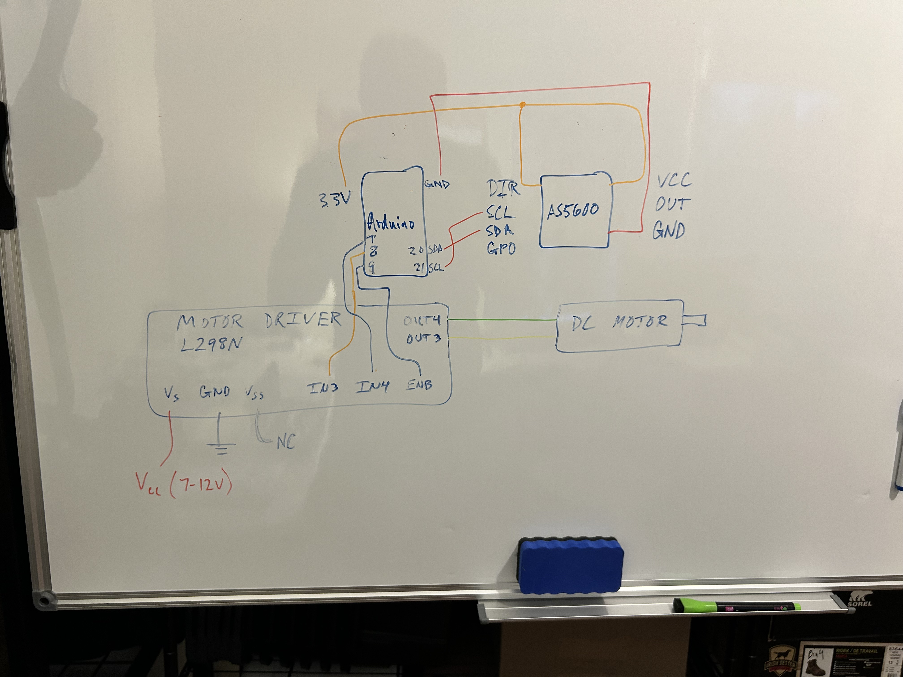

# PID Servo Motor
INSERT GIF OR VIDEO OF FINAL PROJECT

Implement position control of a brushed DC motor using PID control on physical hardware.

## Overview
* Motivation - gain experience on how to setup and tune PID control in a real project.

## Requirements
State why for each point.
* Low cost
* Low dev and build time
* Movement requirements? 
  * Only from x to y angle, doesn't need continuous rotation.
  * Typical control requirements, e.g. rise time, settling time, etc?

## Design
* General setup - vertical vs horizontal. Wanted vertical to see angle better as well as how it's affected by gravity.
* How each part was selected
  * Brushed vs brushless. Didn't want to use an existing library.
  * First used optical encoder connected to motor via pulley and belt. Now using AS5600 magnetic angle sensor, which is contactless.

## Parts

* [Amazon list of parts](https://www.amazon.com/hz/wishlist/ls/3C4NCHU1NNR8F?ref_=wl_share)

* Arduino
* 775 DC motor
* L289N motor driver
* AS5600
* Pulley. Optional. Just need some type of indicator on the end of the motor to observe motor shaft position.
* Power supply (check the max current and voltage I use)

## Schematic (how to connect everything)

Placing white board diagram here for now until a proper diagram is made.

## Software
* See servo_proj/servo_proj.ino file.
* Used the following Arduino libraries:
    - [DueFlashStorage](https://github.com/sebnil/DueFlashStorage)
    - [AS5600](https://github.com/RobTillaart/AS5600)

## Todo
Perhaps make another shorter markdown file, which has the minimum amount of information to set up and get everything working. Don't need theory or reasons behind decisions, etc.

Just give short description of project, specs up front, parts needed, schematic, software.

## Lessons Learned
* Rev 1 used an optical encoder connected to motor via belt and pulleys. Rev 2 now uses an AS5600 magnetic rotary position sensor with a magnet mounted on the rear of the motor shaft. This removes the need for adjusting a belt, the motor doesn't have to contend with belt friction, and the design is more compact. Inspiration from _How To Mechatronics'_ [custom DC servo motor project](https://howtomechatronics.com/projects/how-to-turn-any-dc-motor-into-a-servo-motor/).

## Future Improvements
* Use an electric motor with higher torque. Torque for the 775 motor only has 2.7 kg-cm, whereas the LeRobot/HiWonder SO-ARM101 uses [30 kg-cm servos](https://www.hiwonder.com/products/lerobot-so-101?variant=42198960144471).
* Use a better motor driver like the [TI DRV8871](https://www.ti.com/lit/ds/symlink/drv8871.pdf?ts=1778973033429). Thanks to _How To Mechatronics_ for the inspiration from his [custom DC servo motor project](https://howtomechatronics.com/projects/how-to-turn-any-dc-motor-into-a-servo-motor/).
  - More power efficient
  - Higher peak current
  - More compact

## Resources
* [Interface L298N DC Motor Driver Module with Arduino (Last Minute Engineers)](https://lastminuteengineers.com/l298n-dc-stepper-driver-arduino-tutorial/)
* Following Brett Beauregard's [Improving the Beginner's PID](http://brettbeauregard.com/blog/2011/04/improving-the-beginners-pid-introduction/) articles.
